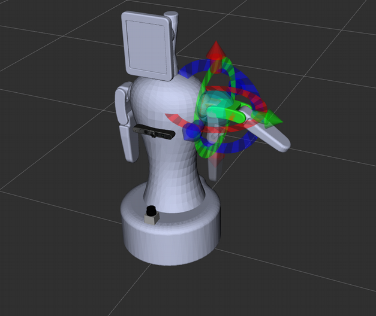

# Source List - sHRI Lab

Technologies required for social robot of sHRI-Lab(social Human-Robot Interaction Laboratory) in KIST(Korea Institute Science and Technology)

## 1. SSL(Sound Source Localization) & SSC(Sound Source Classification)

Description : Detecting direction in 3D-domain to sound source and Classifing 9-type sound 

### Link : [github-Repository](https://github.com/hyeonukbhin/ssl_ssc)

## 2. PEX(Personality recongnition EXperiment Framework)

Description : Automated psychophysical personality data acquisition system for human-robot interaction

[github-Repository](https://github.com/hyeonukbhin/personality_recognition)

## 3. KM(Knowledge Management)

Description : Managing knoweldge that efficiently and Semantically deal with historical data for human-robot interaction

### Link : [github-Repository](https://github.com/hyeonukbhin/personality_recognition)

## 4. Intergracted framework for social robot 

Description : A Framework for running robots in real time based on ROS(Robot Operating System) for linking Social perception about behaviors of human, Social action of robot and Intelligent Planning.

### Link : [github-Repository](https://github.com/deep-task/KIST_Integration)

## 5. Navigation

Description : preparing...

### Link : [github-Repository](https://github.com/deep-task/KIST_Integration)

## 6. Social navigation

Description : preparing...

### Link : [github-Repository](https://github.com/deep-task/KIST_Integration)

## 7. Dialog gathering system for social conversation

Description : A system that automatically acquires dialogue data from multiple users through Google form. The system works through the interaction of the automation server and the Google API. Currently, it is still under development but we are going to add social factors such as the situation of the dialogue in the near future.

### Link : [github-Repository](https://github.com/GyeoreLee/Deeptask_WOZ)

## 8. Perception Sensor Network Unit

Description : Perception Sensing Network Unit in Project "Sensor Network In-Motion Perception In-Clouds" (Reorganizing...). 

### Link : [github-Repository](https://bitbucket.org/simonpicShare/psn_unit)

## 9. action_engine

Description :  It is used to make motion file with xml format and classify motion along with mode.

### Link : [github-Repository](https://github.com/Geonhee-LEE/action_engine.git)

